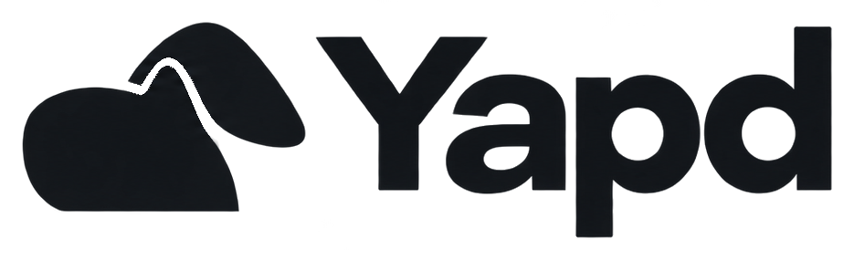

<p align="center">
  <picture>
    <source media="(prefers-color-scheme: dark)" srcset="docs/logo-dark.png">
    
  </picture>
</p>

<p align="center"><strong>Press Record. Have the call. Press Stop. Find the audio and transcript in your folder.</strong></p>

Yapd is a small macOS menu bar app that records a meeting and transcribes it, entirely on your Mac.

## What it does

- Records **the audio other apps play** (Teams, Zoom, Meet in a browser, FaceTime, anything) and **your microphone**, together.
- Saves one folder per recording, in a place you choose: `recording.m4a`, `transcript.txt`, `metadata.json`.
- Transcribes with Apple's on-device speech recognition, labelling who spoke: **You** (microphone) or **Others** (computer audio).
- Starts and stops from anywhere with **⌃⌥⌘−**.

```
[0:00:02] You: Can you hear me?
[0:00:05] Others: Yes, loud and clear. Let's start with the budget.
```

## Principles

- **Private by construction.** No account, no cloud, no analytics, no bot in your meeting. The app contains no networking code.
- **Recording comes first.** Transcription runs afterwards, in the background, and can never interrupt or lose a recording.
- **Native and small.** Swift and SwiftUI on Apple's own frameworks, no third-party dependencies, no virtual audio driver. It lives in the menu bar.
- **Accessible.** Built with VoiceOver, Voice Control and keyboard use in mind. Recording state is announced to VoiceOver and shown by the menu bar icon, never signalled by sound alone.

## How it differs

Typical alternatives, compared on what matters for privacy and setup:

| | **Yapd** | Cloud note-takers (Otter, Fireflies…) | Whisper-based apps | Audio-driver setups (BlackHole…) |
|---|---|---|---|---|
| Audio leaves your Mac | **No** | Yes | No | No |
| Account required | **No** | Yes | Usually no | No |
| Bot joins the call | **No** | Often | No | No |
| Speech model | **Apple's, on-device** | Vendor's servers | A third-party model you download | Not included |
| Capturing the other side | **One macOS permission** | Bot or plug-in | Varies | Install and route a driver |

Yapd is deliberately not a summarizer, an AI assistant or a meeting suite. It produces files, nothing else.

## Requirements

macOS 26 or later. Yapd asks for:

| Permission | Why |
|---|---|
| Microphone | Records your side |
| System Audio Recording | Records the other participants |
| Accessibility | Lets the shortcut work in any app |

The first time you transcribe a language, macOS downloads its speech model itself (an Apple asset, once per language).

## Build

No releases yet; build from source with Xcode 26 or later and [XcodeGen](https://github.com/yonaskolb/XcodeGen).

```sh
git clone https://github.com/ifthenelse/yapd.git && cd yapd
# set your own DEVELOPMENT_TEAM in project.yml first
xcodegen generate
xcodebuild -project Yapd.xcodeproj -scheme Yapd -configuration Release build
```

## Known limits

- Without headphones, the microphone also hears your speakers, so `recording.m4a` carries a faint echo. The transcript removes the duplicated speech; the audio keeps it.
- Speakers are only told apart as You and Others, not per person.
- Early software (0.2.x): expect rough edges.

## Security

See [SECURITY.md](SECURITY.md).
